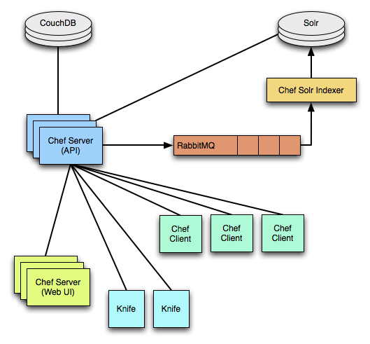
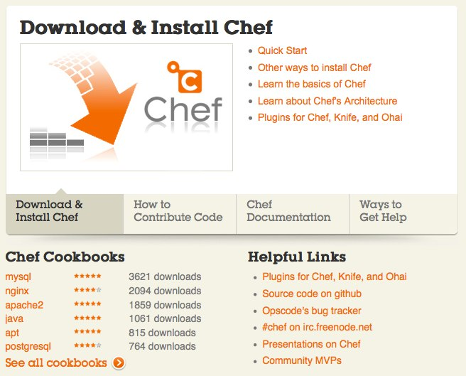
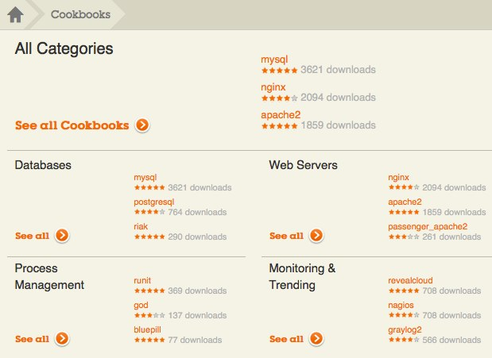
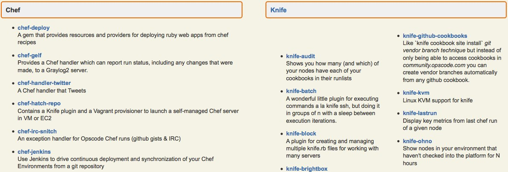

!SLIDE[tpl=default]
# The Joy of Cooking #
## Whip up a Rails Environment with Chef ##
Nathen Harvey, [CustomInk.com](http://www.customink.com)  

[@nathenharvey](http://twitter.com/nathenharvey)

https://github.com/nathenharvey/cooking-with-chef

!SLIDE
# Agenda #
* Infrastructure as Code
* Introduction to Chef
* Building a project in Chef
* Provision a server for your Rails App
* Additional resources

!SLIDE 
# Infrastructure as Code #

* Enable the reconstruction of the business   
from nothing but 
    * a source code repository
    * an application data backup
    * and bare metal resources

-Jesse Robins, Opscode

!SLIDE
# Disposable Servers #

!SLIDE
# Evolution of Server Provisioning #

* Just build it
* Keep notes in server.txt
* Migrate notes to wiki 
* Custom shell scripts (in git)
* Systems integration framework

!SLIDE bullets incremental
# When should I use a systems integration framework? #

* **After**  you outgrow Heroku

!SLIDE bullets incremental
# Which framework?#

* CF Engine?
* Puppet?
* Chef?

!SLIDE bullets incremental
# Wrong question! #

* YES - use a systems integration framework
* YES - use one that works for your team
* YES - this is a talk about **Chef**

!SLIDE
# Chef #

* Declarative - What, not how
* Idempotent - Only take action if required
* Convergent - Takes care of itself

!SLIDE
# Building a Chef Project #

* First, come up with your policy / specification
* Abstract the **resources** in your spec

!SLIDE
# Resources  

    @@@ruby
    package "tmux" do
      action :install
    end

    directory "/u/apps/awesome" do
      owner "apache"
      group "apache"
      action :create
      recursive true
    end

[More resources...](http://wiki.opscode.com/display/chef/Resources)

.notes http://wiki.opscode.com/display/chef/Resources

!SLIDE
# Building a Chef Project #

* First, come up with your policy / specification
* Abstract the **resources** in your spec
* Write **recipes**

!SLIDE
# Recipes

    @@@ruby
    include_recipe "app_user"

    app_name = node["app_name"]
    app_user = node["app_user"]
    app_group = node["app_group"]

    %w(releases shared).each do |dir|
      directory "/u/apps/#{app_name}/#{dir}" do
        mode "0755"
        owner app_user
        group app_group
        recursive true
      end
    end

.notes http://wiki.opscode.com/display/chef/Recipes

!SLIDE
# Building a Chef Project #

* First, come up with your policy / specification
* Abstract the **resources** in your spec
* Write **recipes**
* Package recipes in **cookbooks**

.notes http://wiki.opscode.com/display/chef/Cookbooks
!SLIDE
# Cookbooks

    |-- ldirectord
    |   |-- README.md
    |   |-- attributes
    |   |   `-- default.rb
    |   |-- metadata.rb
    |   |-- recipes
    |   |   `-- default.rb
    |   `-- templates
    |       `-- default
    |           `-- site.cf.erb

.notes http://wiki.opscode.com/display/chef/Cookbooks

!SLIDE
# Cookbooks

    |-- monit
    |   |-- README.rdoc
    |   |-- attributes
    |   |   `-- default.rb
    |   |-- files
    |   |   `-- ubuntu
    |   |       `-- monit.default
    |   |-- metadata.rb
    |   |-- recipes
    |   |   `-- default.rb
    |   `-- templates
    |       `-- default
    |           `-- monitrc.erb

.notes http://wiki.opscode.com/display/chef/Cookbooks

!SLIDE
# Building a Chef Project #

* First, come up with your policy / specification
* Abstract the **resources** in your spec
* Write **recipes**
* Package recipes in **cookbooks**
* Apply recipes to **nodes**

.notes http://wiki.opscode.com/display/chef/Nodes

!SLIDE
# Nodes

* Representation of a host
  * runs the Chef client
  * has attributes
  * has a list of recipes to be applied

.notes http://wiki.opscode.com/display/chef/Nodes

!SLIDE
# Building a Chef Project #

* First, come up with your policy / specification
* Abstract the **resources** in your spec
* Write **recipes**
* Package recipes in **cookbooks**
* Apply recipes to **nodes**
* Group things into **roles**

.notes http://wiki.opscode.com/display/chef/Roles

!SLIDE
# Roles

* mechanism for easily composing sets of functionality
* have attributes and a list of recipes to be applied

.notes http://wiki.opscode.com/display/chef/Roles

!SLIDE
# Roles

    @@@ruby
    name "base"
    description "Base of all nodes"
    default_attributes(
      "newrelic" => {
        "license_key" => "cbb1f5..."
      }
    )

    run_list(
      "recipe[base_config]",
      "recipe[users]",
      "recipe[groups]",
      "recipe[sudo]"
    )

.notes http://wiki.opscode.com/display/chef/Roles

!SLIDE
# Building a Chef Project #

* First, come up with your policy / specification
* Abstract the **resources** in your spec
* Write **recipes**
* Package recipes in **cookbooks**
* Apply recipes to **nodes**
* Group things into **roles**

!SLIDE
# What is Chef? #

.notes http://wiki.opscode.com/display/chef/Architecture

!SLIDE slides incremental
# What is Chef? #

* Server - API, search, Web UI
* Client - chef-client
* Command line tool - knife

.notes http://wiki.opscode.com/display/chef/Architecture

!SLIDE commandline incremental
# knife

    $ knife help list
    bootstrap
    client
    configure
    cookbook
    cookbook-site
    data-bag
    environment
    exec
    index
    knife
    node
    role
    search
    shef
    ssh
    status
    tag

.notes http://wiki.opscode.com/display/chef/Knife

!SLIDE
# What is Chef? #

* Server - API, search, Web UI
* Client - chef-client
* Command line tool - knife
* Inspection library - ohai

!SLIDE
# ohai #

Collects detailed, extensible information about a host.

    @@@ javascript
    {
      "uptime": "13 days 06 hours 16 minutes 02 seconds",
      "platform": "ubuntu",
      "os_version": "2.6.32-38-generic",
      "cpu": {
        "total": 3,
        "real": 0,
        "2": {
          "cache_size": "4096 KB",
          "model": "2",
          "family": "6",
          ...
 
.notes http://wiki.opscode.com/display/chef/Ohai

!SLIDE
# What is Chef? #

* Server - API, search, Web UI
* Client - chef-client
* Command line tool - knife
* Inspection library - ohai
* REPL - shef

.notes http://wiki.opscode.com/display/chef/Shef, http://wiki.opscode.com/display/chef/Getting+Started+with+Shef

!SLIDE # commandline incremental
# shef 
The (poorly named) Chef REPL

    $ shef -a
    Ohai2u nharvey@nathenharvey.local!

.notes http://wiki.opscode.com/display/chef/Shef, http://wiki.opscode.com/display/chef/Getting+Started+with+Shef

!SLIDE 
# shef

    @@@ ruby
    chef > attributes
    chef:attributes > set["shef_example"] = "Hello, rubynation!"
     => "Hello, rubynation!"
    chef:attributes > quit
     => :attributes

.notes http://wiki.opscode.com/display/chef/Shef, http://wiki.opscode.com/display/chef/Getting+Started+with+Shef

!SLIDE 
# shef

    @@@ ruby
    chef > recipe
    chef:recipe > echo off
    chef:recipe > file "/tmp/hello" do
    chef:recipe >     content node.shef_example
    chef:recipe ?>    mode "0777"
    chef:recipe ?>    action :create
    chef:recipe ?>  end

!SLIDE
# shef

    @@@ ruby
    chef:recipe > run_chef
    [Thu, 15 Mar 2012 12:11:02 -0400] DEBUG: Processing file[/tmp/hello] on nathenharvey.local
    [Thu, 15 Mar 2012 12:11:02 -0400] INFO: Processing file[/tmp/hello] action create ((irb#1) line 2)
    [Thu, 15 Mar 2012 12:11:02 -0400] INFO: file[/tmp/hello] created file /tmp/hello
    [Thu, 15 Mar 2012 12:11:02 -0400] INFO: file[/tmp/hello] mode changed to 777
    chef:recipe > exit
     => :recipe
    chef > exit

.notes http://wiki.opscode.com/display/chef/Shef, http://wiki.opscode.com/display/chef/Getting+Started+with+Shef

!SLIDE commandline incremental
# shef

    $ cat /tmp/hello
    Hello, rubynation!

.notes http://wiki.opscode.com/display/chef/Shef, http://wiki.opscode.com/display/chef/Getting+Started+with+Shef

!SLIDE
# What is Chef? #

* Server - API, search, Web UI
* Client - chef-client
* Command line tool - knife
* Inspection library - ohai
* REPL - shef
* Community 

.notes http://community.opscode.com, http://wiki.opscode.com

!SLIDE
# community.opscode.com

!SLIDE
# Community Site

* Publish and share cookbooks

.notes http://community.opscode.com/cookbooks

!SLIDE
# Community Site

* Publish and share plugins for Chef, Knife, and Ohai

.notes http://wiki.opscode.com/display/chef/Community+Plugins
