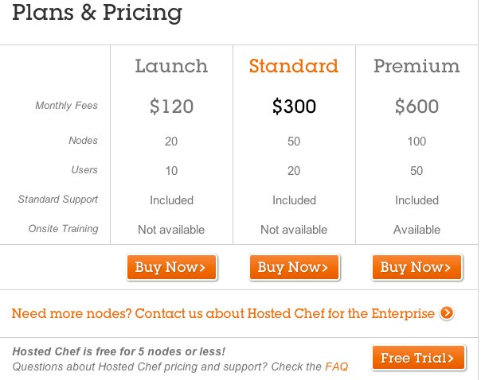

!SLIDE
# Chef Deployment Options

* chef-solo
* Chef Server
* Hosted Chef
* Private Chef

.notes http://wiki.opscode.com/display/chef/The+Different+Flavors+of+Chef

!SLIDE
# chef-solo

* What you don't get: 
  * central server 
  * authentication
  * authorization
  * search indexes
  * persistent attributes 

.notes http://wiki.opscode.com/display/chef/Chef+Solo

!SLIDE
# chef-solo

Execute cookbooks that are stored on disk or available at at URL

    chef-solo -c ~/solo.rb  \
      -j ~/node.json \
      -r http://foo.com/chef-solo.tar.gz

.notes http://wiki.opscode.com/display/chef/Chef+Solo

!SLIDE
# Chef Server

* Open source
* Run it yourself, wherever you like
* Complicated to set-up and manage

.notes http://wiki.opscode.com/display/chef/Chef+Server
!SLIDE
# Hosted Chef

* Best way to get started

.notes http://www.opscode.com/hosted-chef/

!SLIDE
# Private Chef

* Commercial offering
* Managed by Opscode
* Pricing
  * installation fee
  * service contract

.notes http://www.opscode.com/private-chef/

!SLIDE
# Get started with Hosted Chef

1. Create a Hosted Chef account
2. Install and Update dependencies - ruby, ruby gems, ruby-dev and git-core
3. Install Chef and create directories needed
4. Connect to Hosted Chef

.notes http://wiki.opscode.com/display/chef/Fast+Start+Guide

!SLIDE
# Client configuration

* Get organization validation key
* Generate knife config
* Get a private key
* Set-up chef-repo directory
* Copy validation files and knife config to .chef

.notes https://github.com/opscode/chef-repo

!SLIDE
# chef-repo directory

    chef-repo
    |-- .chef
    |   |-- knife.rb
    |   |-- rubynation-validator.pem
    |   `-- rubynation.pem
    |-- README.md
    |-- Rakefile
    |-- certificates
    |-- config
    |   `-- rake.rb
    |-- cookbooks
    |-- data_bags
    |-- environments
    `-- roles

!SLIDE commandline incremental
# Verify setup

    $ knife client list
    rubynation-validator 

!SLIDE 
# Provision a server

* knife ec2 server create
* knife rackspace server create
* Vagrant
 

!SLIDE
# Vagrantfile

    @@@ ruby
    Vagrant::Config.run do |config|
      config.vm.box = "ubuntu64-ruby-1.9"

      config.vm.forward_port 80, 8080

      config.vm.provision :chef_client do |chef|
        chef.chef_server_url = "https://api.opscode.com/organizations/rubynation"
        chef.validation_key_path = "chef-repo/.chef/rubynation-validator.pem"
        chef.validation_client_name = "rubynation-validator"
        chef.node_name = "rubynation.local"
      end
    end

!SLIDE
# Launch Vagrant & Check In
    
    $ vagrant up
    READY

    $ knife node list
    rubynation.local 
