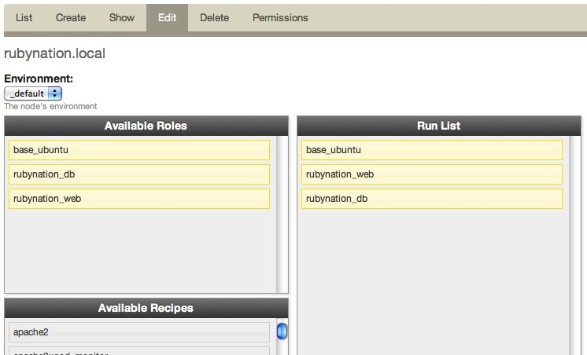

!SLIDE
# Initial set-up steps #

* Register with hosted chef
* Create a chef-repo
* Install chef
* Configure knife.rb
* Configure Vagrant file
* Register Vagrant instance with Chef hosted

!SLIDE 
# Provision for Rails #

* Apache
* Passenger
* MySQL
* Rails application

!SLIDE commandline incremental
# Add passenger_apache2 cookbook #

    $ knife cookbook site install passenger_apache2

.notes http://community.opscode.com/cookbooks/passenger_apache2

!SLIDE 
# Cookbook site install #

1. A new "pristine copy" branch is created in git for tracking the
   upstream
1. All existing cookbooks are removed from the branch
1. The cookbook is downloaded from the cookbook site in tarball form
1. The downloaded cookbook is untarred, and its contents commited via git
1. The pristine copy branch is merged into the master branch

!SLIDE commandline incremental
# Add mysql cookbook #

    $ knife cookbook site install mysql

.notes http://community.opscode.com/cookbooks/mysql

!SLIDE commandline incremental
# Create a Cookbook #

    $ knife cookbook create chefconf
    
    ** Creating cookbook chefconf
    ** Creating README for cookbook: chefconf
    ** Creating metadata for cookbook: chefconf

.notes http://wiki.opscode.com/display/chef/Managing+Cookbooks+With+Knife#ManagingCookbooksWithKnife-create

!SLIDE
# Write our recipes

* default.rb
* web.rb
* db.rb

!SLIDE
# Web Recipe #

Set-up some directories

    @@@ ruby
    %w(releases shared shared/system shared/pids shared/logs shared/config).each do |dir|
      directory "#{deploy_to}/#{app_name}/#{dir}" do
        action :create
        owner app_user
        group app_group
        mode "0664"
        recursive true
      end
    end

!SLIDE
# Web Recipe #

Configure Apache / Passenger

    @@@ ruby
    web_app app_name do
      docroot "#{deploy_to}/current/public"
      server_name "#{app_name}.#{node["domain"]}"
      server_aliases [ app_name, "localhost", node["hostname"] ]
      rails_env "production"
    end

!SLIDE
# Database Recipe #

Create the database 

    @@@ ruby
    mysql_connection_info = {
      :host => "localhost", 
      :username => 'root', 
      :password => 
        node['mysql']['server_root_password']
    }
    
    mysql_database app_name do
      connection mysql_connection_info
      action :create
    end

!SLIDE
#Database Recipe #

Create the database user

    @@@ ruby
    mysql_database_user node["database"]["user"] do
      connection mysql_connection_info
      password  node["database"]["pw"]
      database_name node["database"]["name"]
      host "%"
      action :grant
    end

!SLIDE commandline incremental
# Upload cookbooks to Chef server #

    $ knife cookbook upload -a

!SLIDE
# Create some roles #

* Group recipes together using roles
* Apply roles to nodes
* Our roles:
  * base_ubuntu
  * chefconf_web
  * chefconf_db

!SLIDE
# base_ubuntu Role

    @@@ ruby
    name "base_ubuntu"
    description "all Ubuntu servers"
    run_list(
      "recipe[apt]"
    )

!SLIDE
# chefconf_web Role

    @@@ ruby
    name "chefconf_web"
    description "ChefConf Webserver nodes"
    run_list(
      "recipe[chefconf::web]"
    )

!SLIDE
# chefconf_db Role

    @@@ ruby
    name "chefconf_db"
    description "ChefConf Database nodes"
    run_list(
      "recipe[chefconf::db]"
    )

!SLIDE commandline incremental
# Upload the roles to the server

    $ knife role from file roles/base_ubuntu.rb
    $ knife role from file roles/chefconf_web.rb
    $ knife role from file roles/chefconf_db.rb

!SLIDE commandline
# Assign the roles to our nodes #

    $ knife node run_list add chefconf.local "role[base_ubuntu]"
    $ knife node run_list add chefconf.local "role[chefconf_web]"
    $ knife node run_list add chefconf.local "role[chefconf_db]"

.notes https://manage.opscode.com/nodes/chefconf.local/edit

!SLIDE
# Run chef-client #

* Automatically
* `knife ssh`
* `vagrant provision`

!SLIDE
# Review #

* Server provisioned and communicating with the Chef API
* Apache and Passenger installed with a default configuration
* MySQL installed and running

