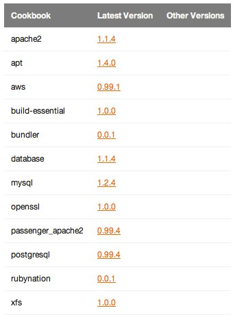
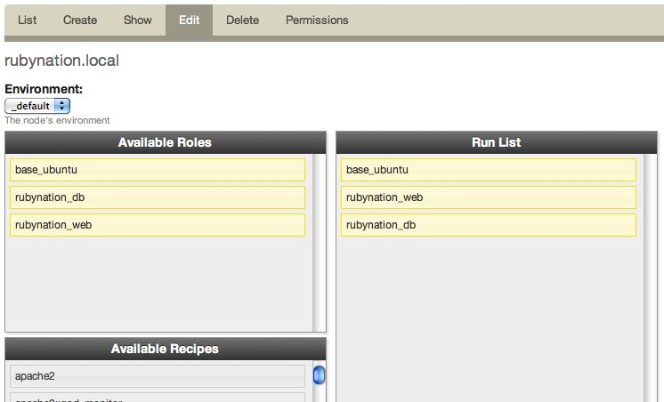

!SLIDE
# Initial set-up steps #

* Register with hosted chef
* Create a chef-repo
* Install chef
* Configure knife.rb
* Configure Vagrant file
* Register Vagrant instance with Chef hosted

!SLIDE 
# Provision for Rails #

* Apache
* Passenger
* MySQL
* Rails application

!SLIDE commandline incremental
# Add passenger_apache2 cookbook #

    $ knife cookbook site install passenger_apache2

.notes http://community.opscode.com/cookbooks/passenger_apache2

!SLIDE commandline incremental
# Add mysql cookbook #

    $ knife cookbook site install mysql

.notes http://community.opscode.com/cookbooks/mysql

!SLIDE commandline incremental
# Create a Cookbook #

    $ knife cookbook create dcrug
   
    ** Creating cookbook dcrug
    ** Creating README for cookbook: dcrug
    ** Creating CHANGELOG for cookbook: dcrug
    ** Creating metadata for cookbook: dcrug 

.notes http://wiki.opscode.com/display/chef/Managing+Cookbooks+With+Knife#ManagingCookbooksWithKnife-create

!SLIDE
# Write our recipes

* default.rb
* web.rb
* db.rb

!SLIDE
# Web Recipe #

Set-up some directories

    @@@ ruby
    %w(releases shared shared/system shared/pids shared/logs shared/config).each do |dir|
      directory "#{deploy_to}/#{app_name}/#{dir}" do
        action :create
        owner app_user
        group app_group
        mode "0664"
        recursive true
      end
    end

!SLIDE
# Web Recipe #

Configure Apache / Passenger

    @@@ ruby
    web_app app_name do
      docroot "#{deploy_to}/current/public"
      server_name "#{app_name}.#{node["domain"]}"
      server_aliases [ app_name, "localhost", node["hostname"] ]
      rails_env "production"
    end

!SLIDE
# Database Recipe #

Create the database 

    @@@ ruby
    mysql_connection_info = {
      :host => "localhost", 
      :username => 'root', 
      :password => 
        node['mysql']['server_root_password']
    }
    
    mysql_database app_name do
      connection mysql_connection_info
      action :create
    end

!SLIDE
#Database Recipe #

Create the database user

    @@@ ruby
    mysql_database_user node["database"]["user"] do
      connection mysql_connection_info
      password  node["database"]["pw"]
      database_name node["database"]["name"]
      host "%"
      action :grant
    end

!SLIDE commandline incremental
# Upload cookbooks to Chef server #

    $ knife cookbook upload -a

!SLIDE
# Create some roles #

* Group recipes together using roles
* Apply roles to nodes
* Our roles:
  * base_ubuntu
  * dcrug_web
  * dcrug_db

!SLIDE
# base_ubuntu Role

    @@@ ruby
    name "base_ubuntu"
    description "all Ubuntu servers"
    run_list(
      "recipe[apt]"
    )

!SLIDE
# dcrug_web Role

    @@@ ruby
    name "dcrug_web"
    description "DCRUG Webserver nodes"
    run_list(
      "recipe[dcrug::web]"
    )

!SLIDE
# dcrug_db Role

    @@@ ruby
    name "dcrug_db"
    description "DCRUG Database nodes"
    run_list(
      "recipe[dcrug::db]"
    )

!SLIDE commandline incremental
# Upload the roles to the server

    $ knife role from file roles/base_ubuntu.rb
    $ knife role from file roles/dcrug_web.rb
    $ knife role from file roles/dcrug_db.rb

!SLIDE commandline
# Assign the roles to our nodes #

    $ knife node run_list add dcrug.local "role[base_ubuntu]"
    $ knife node run_list add dcrug.local "role[dcrug_web]"
    $ knife node run_list add dcrug.local "role[dcrug_db]"

.notes https://manage.opscode.com/nodes/dcrug.local/edit

!SLIDE
# Run chef-client #

* Automatically
* `knife ssh`
* `vagrant provision`

!SLIDE
# Review #

* Server provisioned and communicating with the Chef API
* Apache and Passenger installed with a default configuration
* MySQL installed and running

